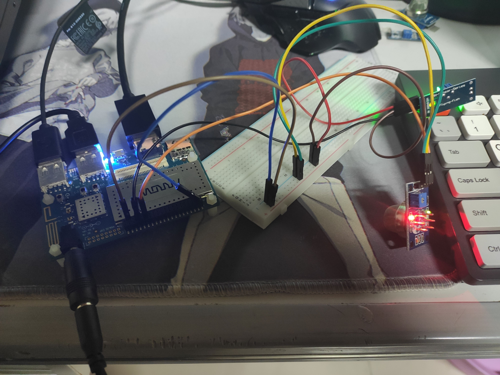

# About BasicAlarmSystem

## Introduction
BasicAlarmSystem is about designing and implementing a smart environmental monitoring system that can detect gas leakage and light conditions, and send alert messages via GSM module.
Based on DragonBoard 410c, MQ-2 gas sensor, MH-Sensor Flying-Fish and SIM800A

## Prepare Materials
Materials that must be prepared:

1. DragonBoard 410c x1 
2. MH-Sensor Flying-Fish x1 (4-pin photoresistor module)
3. MQ-2 gas sensor x1 
4. SIM800A GMS module x1 
5. Dupont wires 
6. Breadboard x1 
7. Display x1 
8. HDMI converter, power adapter

## Hardware Setup

1. Connect SIM800A module to DragonBoard 410c’s USB port via USB to TTL serial cable, insert SIM card and check antenna status
2. Connect photoresistor module’s VCC pin to DragonBoard 410c’s 5V pin, GND pin to DragonBoard 410c’s GND pin, DO pin to DragonBoard 410c’s GPIO_34 pin
3. Connect gas sensor module’s VCC pin to DragonBoard 410c’s 5V pin, GND pin to DragonBoard 410c’s GND pin, DO pin to DragonBoard 410c’s GPIO_30 pin
4. Connect DragonBoard 410c to display via HDMI cable, and plug in power cord and keyboard mouse